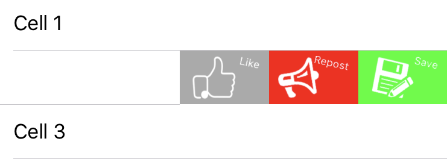

# TCSCustomRowActionFactory

[](https://cocoapods.org/pods/TCSCustomRowActionFactory)
[](https://cocoapods.org/pods/TCSCustomRowActionFactory)
[](https://cocoapods.org/pods/TCSCustomRowActionFactory)


TCSCustomRowActionFactory allows you to setup the swipe actions for cells in a table view in any way using UIView and other convenient methods (see the [article explaining this on Habrahabr](https://habr.com/post/414019/))



## Usage and examples
TCSCustomRowActionFactory is primarily designed to simplify the standard UITableViewRowAction configuration (due to the many restrictions it imposes), also supporting the new ContextualAction (iOS 11 and above). All you need to do to implement TCSCustomRowActionFactory, create a TCSCustomRowActionFactory instance in the table delegate method, configure it with our custom view and return the required object (.rowAction () or .contextualAction(for: indexPath) depending on the table delegate method)

```swift
func tableView(_ tableView: UITableView, editActionsForRowAt indexPath: IndexPath) -> [UITableViewRowAction]? {
    guard let cell = tableView.cellForRow(at: indexPath) else { return nil }
    
    var rowActions: [UITableViewRowAction] = []
    
    let rowActionFactory = TCSCustomRowActionFactory { indexPath in
        tableView.setEditing(false, animated: true)
    }
    let rowActionView = <...> // create row action view
    rowActionView.backgroundColor = .green
    rowActionFactory.setupForCell(with: rowActionView)
    
    if let rowAction = rowActionFactory.rowAction() {
        rowActions.append(rowAction)
    }
    
    return rowActions
}

```


## Methods

There are some methods to setup TCSCustomRowActionFactory:

```swift
func setupForCell(with view: UIView)
```

```swift
func setupForCell(withImage image: UIImage, size: CGSize, backgroundColor: UIColor = .white) 
```

```swift
func setupForCell(withImage image: UIImage, size: CGSize, backgroundColor: UIColor = .white, contentInsets: UIEdgeInsets = .zero)
```

```swift
func setupForCell(withImage image: UIImage, size: CGSize, backgroundColor: UIColor = .white, contentInsets: UIEdgeInsets = .zero, isScaleProportionally: Bool = true)
```

```swift
func setupForCell(withTitle title: String, image: UIImage, size: CGSize, backgroundColor: UIColor, titleAttributes: [NSAttributedStringKey : Any]? = nil, contentInsets: UIEdgeInsets? = nil)
```


## Example

To run the example project, clone the repo, and run `pod install` from the Example directory first.


## Requirements


## Installation

TCSCustomRowActionFactory is available through [CocoaPods](https://cocoapods.org). To install
it, simply add the following line to your Podfile:

```ruby
pod 'TCSCustomRowActionFactory'
```


## Contribution

Sure :) please send a pull-request or raise an issue. It is always good to know how to make things better, yay!


## Author

Alexander Trushin, a.trushin@tinkoff.ru


## License

TCSCustomRowActionFactory is available under the Apache License, Version 2.0. See the LICENSE file for more info.
